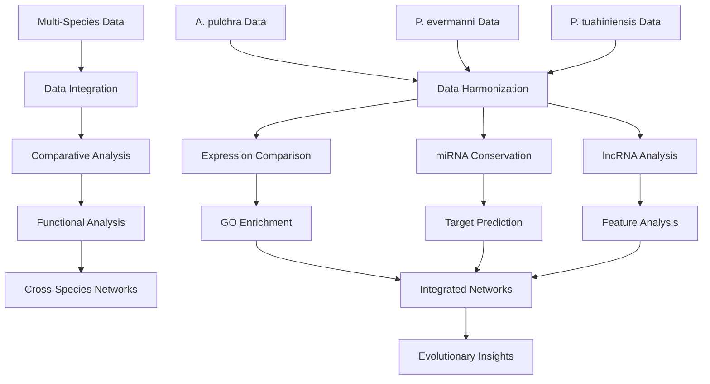

# M-multi-species Code Directory

## Overview

This directory contains comparative bioinformatics analyses across multiple coral species (*Acropora pulchra*, *Porites evermanni*, and *Porites tuahiniensis*). The analysis focuses on cross-species comparisons of gene expression, miRNA conservation, lncRNA discovery, and functional annotation to understand evolutionary patterns and species-specific adaptations.

## Workflow Schematic

## Key Results

- **Cross-Species Expression**: Identified conserved and species-specific gene expression patterns
- **miRNA Conservation**: Discovered conserved miRNAs across coral species
- **lncRNA Discovery**: Identified and characterized lncRNAs across species
- **Functional Evolution**: Analyzed functional enrichment patterns across species
- **Regulatory Networks**: Constructed cross-species regulatory networks
- **Evolutionary Patterns**: Identified evolutionary conserved and divergent regulatory elements

## File Descriptions

### Data Integration and Processing

- **`01-lncRNA-pipeline.qmd`**: Complete lncRNA discovery and analysis pipeline across species
- **`01.5.sh`**: Bash script for lncRNA pipeline automation
- **`01.6-lncRNA-pipeline.qmd`**: Extended lncRNA analysis pipeline
- **`02-lncRNA-position.qmd`**: Analyzes lncRNA genomic positions and features
- **`03-expression-matrix-correlations.qmd`**: Performs correlation analysis across expression matrices
- **`03-RNA-miRNA-lncRNA-comparison-figures.Rmd`**: Generates comparison figures for RNA, miRNA, and lncRNA data

### miRNA Analysis

- **`04-miRNA-comparison.Rmd`**: Comprehensive miRNA comparison across species
- **`04.1-miRNA-comparison-expression.Rmd`**: Compares miRNA expression patterns across species
- **`04.2-miRNA-comparison-targets-FE.Rmd`**: Functional enrichment analysis of miRNA targets across species
- **`07-miRNA-stats.Rmd`**: Statistical analysis of miRNA characteristics across species

### Functional Analysis

- **`05-expressed-mRNA-GO-enrichment-comparison.Rmd`**: Compares GO enrichment patterns across species
- **`05.1-expressed-mRNA-top10-GOslim-GO-counts.Rmd`**: Analyzes top GO terms and counts across species

### lncRNA Analysis

- **`06-lncRNA-stats.Rmd`**: Statistical analysis of lncRNA characteristics across species
- **`08-lncRNA-features.Rmd`**: Analyzes lncRNA features and properties across species

### Integration and Visualization

- **`09-ncRNA-protein-expression.Rmd`**: Integrates ncRNA and protein expression data across species

### Utility Scripts

- **`uniprot-retrieval.py`**: Python script for retrieving UniProt protein data
- **`.gitignore`**: Git ignore file for version control

## Data Flow

1. **Data Integration**: Harmonizes data from multiple species into comparable formats
2. **Comparative Analysis**: Performs cross-species comparisons of gene expression, miRNAs, and lncRNAs
3. **Functional Analysis**: Analyzes functional enrichment patterns across species
4. **Network Construction**: Builds cross-species regulatory networks
5. **Evolutionary Analysis**: Identifies conserved and divergent patterns
6. **Visualization**: Creates comparative visualizations and figures

## Key Software Tools

- **R/Bioconductor**: Statistical analysis and visualization
- **Python**: Data processing and UniProt retrieval
- **Bash**: Pipeline automation
- **ggplot2**: Data visualization
- **pheatmap**: Heatmap generation
- **ggvenn**: Venn diagram creation
- **ape**: Phylogenetic analysis

## Cross-Species Comparisons

### Species Analyzed

1. **Acropora pulchra (A. pulchra)**
   - Branching coral species
   - Complex genome structure
   - High gene diversity

2. **Porites evermanni (P. evermanni)**
   - Massive coral species
   - Robust genome
   - Stress-tolerant

3. **Porites tuahiniensis (P. tuahiniensis)**
   - Massive coral species
   - Closely related to P. evermanni
   - Environmental adaptation

### Analysis Types

- **Expression Conservation**: Identifies genes with conserved expression patterns
- **miRNA Conservation**: Discovers conserved miRNA families and targets
- **lncRNA Evolution**: Analyzes lncRNA conservation and divergence
- **Functional Conservation**: Compares functional enrichment patterns
- **Regulatory Networks**: Constructs cross-species regulatory networks

## Output Structure

All outputs are organized in the `../output/` directory with subdirectories corresponding to each analysis step. Key outputs include:

- Cross-species comparison tables (CSV, TSV)
- Conservation analysis results
- Functional enrichment comparisons
- Network files (CSV, GML)
- Visualization plots (PDF, PNG)
- Statistical summaries

## Key Findings

- **Conserved miRNAs**: Identified miRNAs conserved across all three species
- **Species-Specific Adaptations**: Found species-specific gene expression patterns
- **Regulatory Evolution**: Analyzed evolution of regulatory networks
- **Functional Conservation**: Discovered conserved functional pathways
- **lncRNA Diversity**: Characterized lncRNA diversity across species

## Citation

Please cite the original papers for the software tools used in this analysis, as well as any relevant publications from the E5 coral research group.
